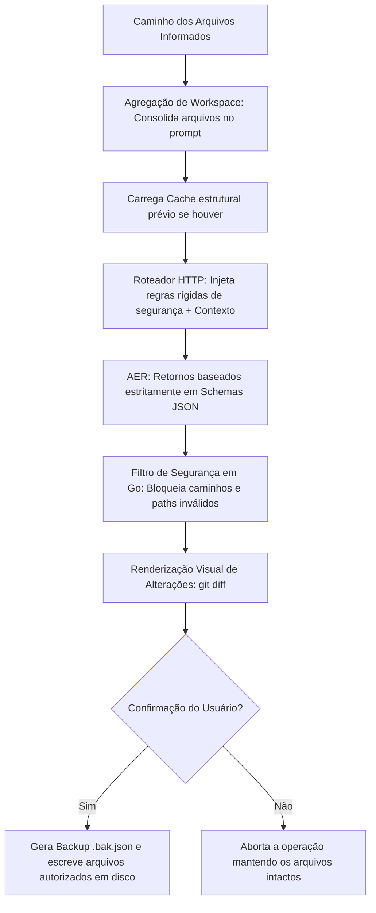

# Logos CLI

Logos é um assistente de desenvolvimento de IA focado em automação e edição de código estruturado diretamente pelo terminal. Desenvolvido em Go puro, o projeto foi concebido para atuar como um agente local eficiente, mitigando o desperdício de tokens na janela de contexto através de isolamento de escopo, gerenciamento de cache arquitetural e validação rígida de outputs via schemas estruturados.

## Visão Geral da Arquitetura

O diferencial técnico do Logos reside no controle manual do ambiente de execução e do payload enviado às LLMs, garantindo previsibilidade e segurança ao alterar arquivos em disco:

1.  **Harness de Contexto e Agregação de Arquivos**: O agente permite ler múltiplos arquivos simultaneamente (como códigos-fonte, arquivos de documentação, requisitos de vagas ou perfis profissionais). O sistema lê e empilha esses dados no payload, fornecendo todo o contexto necessário para que a IA gere alterações cirúrgicas.
2.  **Isolamento de Metadados e Caches Globais**: O Logos resolve caminhos dinamicamente e cria um diretório oculto centralizado (`.logos_meta/`). Nele são armazenados mapas estruturais descritivos (`.cache`), hashes de validação de estado e cópias de segurança completas em lote (`.bak.json`), limpando visualmente a raiz do workspace.
3.  **Casco de Proteção de Disco (Hard Wall)**: O motor em Go valida estritamente o retorno da IA. Se o modelo tentar extrapolar seu escopo gerando caminhos de arquivos indevidos, ou tentar corromper arquivos estruturais vitais (como o próprio `main.go` ou configurações locais em `env/`), o Logos intercepta o payload, aplica o log de erro e aborta a escrita.
4.  **Geração Baseada em JSON Estruturado**: Diferente de abordagens baseadas em parsing de markdown livre, o ecossistema do Logos força os provedores a responderem em formatos JSON rígidos com estruturas de propriedades previamente delimitadas, minimizando quebras de processamento.

## Estrutura do Projeto

O projeto adota o design *Flat Grouped*, organizando os Markdowns em documentação centralizada e isolando as chaves de ambiente:

```plain
LOGOS/
├── .logos_meta/         # Metadados, históricos de rollback e caches locais (Ignorado)
├── docs/                # Documentação descritiva e arquivos de instrução do agente
│   ├── commit_pattern.md
│   ├── progress.md      # Registro histórico consolidado de alterações e uso de tokens
│   └── prompt.md        # Instrução descritiva padrão do espaço de trabalho
├── env/                 # Diretório restrito de configurações de ambiente
│   └── .env             # Chaves de API locais (Ignorado)
├── logos/               # Módulos internos do pacote central do Logos
│   ├── ai.go            # Conector de APIs (Gemini/Groq), backoff exponencial e parser JSON
│   ├── config.go        # Loader de ambiente e injeção inteligente do .gitignore
│   ├── disk.go          # Leitor de workspace estruturado, gerador de MetaPaths e rollback
│   ├── prompts.go       # Armazenamento de prompts estáticos do sistema
│   └── terminal.go      # Renderizador visual de diffs coloridos e captura de confirmação
├── .gitignore           # Defesas estruturais auto-atualizáveis
├── go.mod               # Declaração do módulo Go nativo
└── main.go              # Ponto de entrada, tratamento de flags e roteamento de escopo
```

## Instalação

Para compilar o binário e disponibilizá-lo diretamente no terminal do seu sistema operacional:

```bash
git clone [https://github.com/Elliton-Luis/logos.git](https://github.com/Elliton-Luis/logos.git)
cd logos
go build -o logos .
sudo mv logos /usr/local/bin/
```

Após o build, o comando torna-se global:

```bash
logos <ação> <arquivos_alvo...> [instrução]
```

## Uso

### Modos de Operação

#### 1. Modo Interativo

Execute o binário sem argumentos adicionais para iniciar o assistente passo a passo no terminal:

```bash
go run .
```

#### 2. Modo CLI Inline

Os parâmetros podem ser passados em lote diretamente para execução em linha de comando:

```bash
go run . <ação> <arquivos_alvo...> [instrução_ou_texto]
```

### Ações Disponíveis (`<ação>`)

| Comando    | Tipo    | Descrição                                                                                                   |
| :--------- | :------ | :---------------------------------------------------------------------------------------------------------- |
| `feat`     | Edição  | Cria um arquivo do zero ou insere uma nova lógica funcional no local semântico correto.                     |
| `fix`      | Edição  | Analisa o arquivo atual, localiza a falha reportada e corrige estritamente a linha defeituosa.              |
| `refactor` | Edição  | Otimiza performance e legibilidade do código aplicando Clean Code sem alterar o comportamento.              |
| `doc`      | Edição  | Insere documentação técnica útil (padrão GoDoc ou equivalentes) nas assinaturas de funções.                 |
| `cache`    | Suporte | Força o sistema a computar o mapa estrutural descritivo do arquivo no diretório `.logos_meta`.              |
| `undo`     | Suporte | Executa um rollback em lote, restaurando o estado anterior dos arquivos através do arquivo `.bak.json`.      |

### Modificadores e Atalhos Globais (Flags)

As flags de controle de provedor e modelo devem ser inseridas antes da declaração da ação da CLI:

*   `-gemini`: Atalho instantâneo. Chaveia o fluxo para a API do Google AI Studio utilizando o modelo de alta performance `gemini-2.5-flash`.
*   `-groq`: Atalho instantâneo. Altera o fluxo para o provedor Groq executando o modelo `llama-3.3-70b-versatile`.
*   `-p <provedor>`: Define manualmente o provedor de destino (`groq` ou `gemini`).
*   `-m <modelo>`: Substitui o identificador do modelo em tempo de execução.
*   `-v`: Ativa o modo verboso, expondo logs de debug internos e payloads trafegados.
*   `--dry-run`: Consulta a IA e plota o visualizador de alterações na tela, mas descarta a escrita física em disco.

### Exemplos Práticos

**Alteração rápida local de escopo único:**

```bash
logos -gemini feat main.py "Faça uma função de soma"
```

Garante uma resposta purista, idiomática e sem injeções de códigos redundantes de teste.

**Geração ou Ajuste de Contexto Baseado em Múltiplos Arquivos (ex: Currículo):**

```bash
logos -gemini feat cv_atual.md modelo_vaga.txt perfil_profissional.md docs/prompt.md
```

O Logos fará a leitura integral de todos os arquivos informados no comando, aplicando as diretrizes contidas em `docs/prompt.md` para atualizar cirurgicamente apenas o arquivo de destino.

**Refatoração Segura de Código:**

```bash
logos --dry-run refactor controllers/user.go
```

Exibe o diff completo e colorido comparando o código atual e a sugestão da IA sem modificar o arquivo original.

**Desfazer Alterações:**

```bash
logos undo controllers/user.go
```

## Fluxo de Processamento


