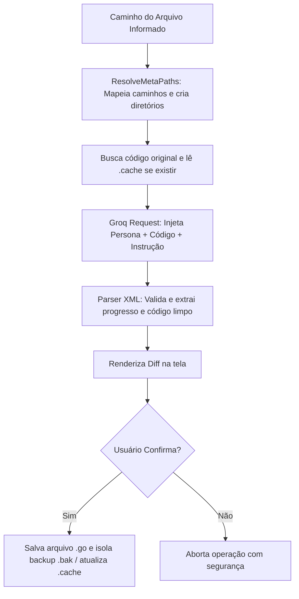

# Logos CLI
Logos é um editor de código assistido por Inteligência Artificial (LLMs) de alta performance rodando diretamente no terminal. O projeto foi concebido do zero em Go puro com o objetivo de estudar e validar o comportamento de agentes autônomos de IA, buscando máxima eficiência de processamento e economia de tokens através de um harness arquitetural customizado.

## A Ideia do Projeto & O Harness Customizado
O diferencial técnico do projeto reside em como o contexto e o ambiente de execução são gerenciados de forma manual para extrair o máximo do modelo de linguagem:

1. **O Harness de Contexto Baseado em Cache**: A IA nunca recebe dados cegamente. Toda vez que um arquivo é processado, o sistema gera um mapa estrutural descritivo do código (.cache). Esse cache serve como um "ancorador arquitetural", garantindo que modificações incrementais respeitem as variáveis globais sem estourar a janela de contexto.
2. **Isolamento de Metadados Contra Sujeira Visual**: Arquivos de suporte de IA costumam poluir o espaço de trabalho. O Logos mitiga isso analisando o caminho do arquivo e criando automaticamente uma subpasta dedicada de metadados (ex: testes/script-go/), onde esconde caches, hashes de validação e backups (.bak) locais.
3. **Padrão XML Restrito e Sanitização**: Para prevenir alucinações, o motor impõe um output rígido encapsulado em tags XML. O Logos intercepta o fluxo bruto, extrai a modificação e rejeita qualquer lixo textual adjacente.

## Arquitetura do Sistema
O projeto adota um design *Flat Grouped*, mantendo alta modularidade sem criar árvores de arquivos profundas ou pacotes excessivos:

* **`main.go` (Ponto de Entrada)**: Responsável por parsear as flags da CLI, inicializar o ambiente e orquestrar o fluxo principal das ações.
* **`logos/ai.go` (Engine de IA)**: Controla a integração HTTP com a API do Groq, gerencia o algoritmo de *Backoff Exponencial* para retries e faz o parse das tags XML.
* **`logos/config.go` (Configurações)**: Gerencia o carregamento dinâmico do `.env` e a criação automatizada de defesas estruturais como o `.gitignore`.
* **`logos/disk.go` (Gerenciador de Disco)**: Onde reside a inteligência do *harness* para mapear caminhos, isolar arquivos de suporte, criar diretórios sob demanda e rodar rotinas de rollback.
* **`logos/prompts.go` (Cognição)**: Centraliza as personas (System Prompts) do agente para cada modo de operação (`feat`, `fix`, `refactor`, `doc`).
* **`logos/terminal.go` (Interface)**: Engine de captura de inputs do usuário, confirmações e renderização visual do `git diff`.

## Estrutura de Pastas
```plain
LOGOS/
├── logos/               # Core Engine (Pacote isolado do Logos)
│   ├── ai.go            # Conector Groq, gerenciador de retries e parser XML
│   ├── config.go        # Setup do .env e gerador automático de .gitignore
│   ├── disk.go          # Resolução de MetaPaths e isolamento de arquivos técnicos
│   ├── prompts.go       # System Prompts e injeção de regras estruturadas
│   └── terminal.go      # Sistema de interações no console e renderizador de diff
├── .env                 # Chaves de API locais (Ignorado no Git)
├── go.mod               # Declaração do módulo Go puro
├── main.go              # Arquivo principal e tratamento de flags
└── progress.md          # Log consolidado de progresso do Agente
```

## Modos de Operação e Comandos
O Logos opera tanto de forma inline quanto em um modo assistido:
1. Modo Interativo
Execute o binário sem argumentos adicionais para iniciar o assistente passo a passo no console:
```bash
go run main.go
```
2. Modo CLI Inline
Passe os parâmetros diretamente para execução imediata:
```bash
go run main.go <ação> <caminho_do_arquivo> ["instrução"]
```

**OU**

1. Fazer o Build do projeto:

```bash
git clone https://github.com/Elliton-Luis/logos.git
cd logos
go build -o logos .
sudo mv logos /usr/local/bin/
```
2. A partir disso os comandos seriam:

```
logos <ação> <caminho_do_arquivo> ["instrução"]
```
Ex. logos feat controllers/userController "Faça as funçoes de Criar e deletar um Usuario"

## Ações Disponíveis (<ação>)
| Comando | Escopo | Descrição |
| --- | --- | --- |
| feat | Edição | Cria um arquivo do zero ou insere uma nova lógica no local ideal da estrutura existente. |
| fix | Edição | Analisa o código atual, isola o bug relatado na instrução e corrige estritamente a linha defeituosa. |
| refactor | Edição | Otimiza a performance e legibilidade do código aplicando Clean Code sem alterar o comportamento atual. |
| doc | Edição | Insere documentação técnica útil (padrão GoDoc) nas funções e structs sem tocar na lógica de programação. |
| cache | Suporte | Força o harness a atualizar o mapa estrutural descritivo (.cache) do arquivo alvo. |
| undo | Suporte | Desfaz instantaneamente a última alteração, restaurando o arquivo original com base no .bak isolado. |

## Modificadores Globais (Flags) -- Em Desenvolvimento
- `-m <modelo>`: Altera o modelo de IA em tempo de execução (Padrão: llama-3.3-70b-versatile).
- `-v`: Ativa logs verbosos de Debug (Exibe payloads trafegados na API e status de retries).
- `--dry-run`: Executa a consulta e renderiza o diff na tela, mas não altera nada em disco.

## Exemplos Práticos de Uso
Criar uma nova rotina isolando a sujeira técnica automaticamente:
```bash
go run main.go feat testes/calculadora.go "crie uma funcao de soma"
```
Gera o arquivo testes/calculadora.go limpo e move caches/backups para testes/calculadora-go/.

Refatorar o código sem aplicar as mudanças em disco (Modo Seguro):
```bash
go run main.go --dry-run refactor testes/calculadora.go "otimize o laço de repeticao"
```
Reverter o arquivo para o estado anterior:
```bash
go run main.go undo testes/calculadora.go
```

## Fluxo de Processamento do Harness


## Roadmap de Evolução
- [ ] Suporte a Contexto Multi-Arquivo: Evoluir o ResolveMetaPaths para permitir que o Agente leia arquivos de dependência correlacionados.
- [ ] Local LLM Integration: Adaptar o conector do ai.go para chavear rotas de API locais via Ollama.
- [ ] Token Counter Autônomo: Implementar um calculador local de tokens antes do envio do payload para otimização preditiva de custos.